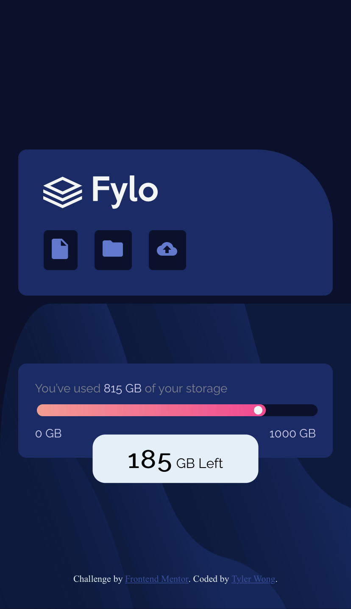

# Frontend Mentor - Fylo data storage component

## Intro
This is a frontend coding challege given by Frontend Mentor. The challenge is to build out a data storage component and get it looking as close to the design as possible.

You can click [here](https://www.frontendmentor.io/challenges/fylo-data-storage-component-1dZPRbV5n) to see the design.

## Demo
### Demo Link
<a href="https://fylo-data-storage-component.tylerw.vercel.app" target="_blank">Click me!</a>

### Demo Preview

    
Web version

    

    
Mobile version

    

## Languages
- HTML
- CSS